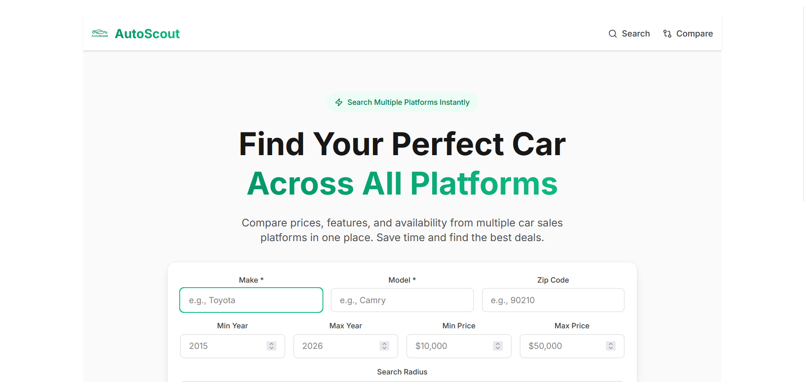
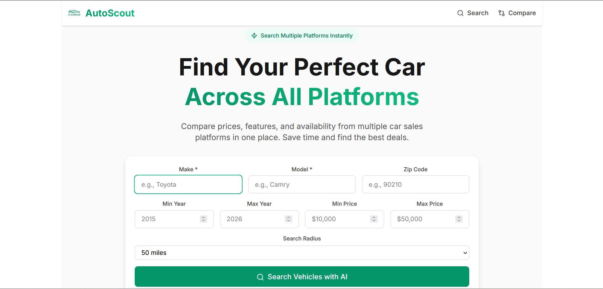

<!--
    ____  ___    __  ___
   / __ \/   |  /  |/  /
  / /_/ / /| | / /|_/ / 
 / _, _/ ___ |/ /  / /  
/_/ |_/_/  |_/_/  /_/ 
AutoScout
Version 0.0.0
-->

<div align="center">
  
# 🚀 AutoScout

### AI-Powered Car Sales Search - Compare prices across platforms in one place

[](LICENSE)
[](https://github.com/rayanthoney/ram911_autoScout/releases)
[](https://github.com/rayanthoney/ram911_autoScout/actions)
[](http://makeapullrequest.com)

[**Live Demo**](https://auto-scout-alpha.vercel.app/) · [**Documentation**](./docs) · [**Report Bug**](https://github.com/rayanthoney/ram911_autoScout/issues) · [**Request Feature**](https://github.com/rayanthoney/ram911_autoScout/issues)

<!--  -->

<!--  -->


</div>

---

## 📋 Table of Contents

- [About The Project](#about-the-project)
- [✨ Features](#features)
- [🎯 Demo](#demo)
- [⚙️ Tech Stack](#tech-stack)
- [🚀 Getting Started](#getting-started)
  - [Prerequisites](#prerequisites)
  - [Installation](#installation)
  - [Environment Variables](#environment-variables)
- [💻 Usage](#usage)
- [📸 Screenshots](#screenshots)
- [🗺️ Roadmap](#roadmap)
- [🤝 Contributing](#contributing)
- [📜 License](#license)
- [👤 Contact](#contact)
- [🙏 Acknowledgments](#acknowledgments)

---

## 📖 About The Project

<!--  -->



**AutoScout** is an AI-powered web application that aggregates car sales data from multiple sources using Google Gemini Pro, enabling users to quickly compare prices, availability, and details for specific vehicle models across different platforms.

### Why This Project?

- 🎯 **Unified Search** - Search multiple car sales platforms from a single interface
- 💡 **AI-Powered** - Leverages Google Gemini Pro for intelligent data extraction
- ⚡ **Save Time** - No more visiting multiple websites to compare prices

<p align="right">(<a href="#top">back to top</a>)</p>

---

## ✨ Features

<div align="center">

| Feature | Description |
|---------|-------------|
| 🔍 **AI-Powered Search** | Uses Google Gemini Pro to search across multiple car sales websites |
| 🚗 **Multi-Source Aggregation** | Consolidates listings from Autotrader, Cars.com, CarGurus, and more |
| 🏛️ **Advanced Filtering** | Filter by price, mileage, year, location, body style, transmission |
| 📊 **Results Comparison** | Side-by-side comparison of up to 4 vehicles |
| ⚡ **Smart Caching** | 10-minute result caching for faster subsequent searches |
| 💾 **Saved Searches** | Persist search criteria for quick access (localStorage) |

</div>

<p align="right">(<a href="#top">back to top</a>)</p>

---

## 🎯 Demo

### 🌐 Live Demo

Check out the live application: **[AutoScout Live Demo](https://auto-scout-alpha.vercel.app/)**

### 🎥 Video Walkthrough

<!--  -->

<p align="right">(<a href="#top">back to top</a>)</p>

---

## ⚙️ Tech Stack

### Frontend
[](https://reactjs.org/)
[](https://vitejs.dev/)
[](https://developer.mozilla.org/en-US/docs/Web/JavaScript)
[](https://tailwindcss.com/)
[](https://reactrouter.com/)

### Backend
[](https://nodejs.org/)
[](https://expressjs.com/)
[](https://ai.google.dev/)

### Tools & Services
[](https://git-scm.com/)
[](https://github.com/)
[](https://code.visualstudio.com/)
[](https://vercel.com/)

<!-- <div align="center">
  <a href="https://skillicons.dev">
    
  </a>
</div> -->

<p align="right">(<a href="#top">back to top</a>)</p>

---

<details>
<summary><h2>🚀 Getting Started (Click to Expand)</h2></summary>

Follow these steps to get a local copy up and running.

### Prerequisites

Before you begin, ensure you have the following installed:

- **Node.js** (v18 or higher)
  ```sh
  node --version
  ```

- **npm** or **yarn**
  ```sh
  npm --version
  # or
  yarn --version
  ```

- **Google Gemini API Key** (free tier available)
  - Get your API key at [Google AI Studio](https://aistudio.google.com/)

### Installation

1. **Clone the repository**
   ```sh
   git clone https://github.com/rayanthoney/ram911_autoScout.git
   ```

2. **Navigate to the project directory**
   ```sh
   cd ram911_autoScout
   ```

3. **Install dependencies**
   ```sh
   npm install
   ```

4. **Set up environment variables**
   ```sh
   cp .env.example .env
   ```
   Then edit `.env` and add your Gemini API key (see [Environment Variables](#environment-variables))

5. **Start the development servers** (frontend + backend)
   ```sh
   npm run dev:all
   ```

6. **Open your browser** and navigate to:
   ```
   http://localhost:5173
   ```

### Environment Variables

Create a `.env` file in the root directory with the following variables:

```env
# Google Gemini API
GEMINI_API_KEY=your_gemini_api_key_here

# Server Configuration
PORT=3000
NODE_ENV=development

# Cache Configuration
CACHE_TTL=900

# API Rate Limiting
MAX_REQUESTS_PER_MINUTE=60
```

> ⚠️ **Important:** Never commit your `.env` file to version control!

</details>

<p align="right">(<a href="#top">back to top</a>)</p>

---

<details>
<summary><h2>💻 Usage (Click to Expand)</h2></summary>

### Basic Usage

1. **Search for Vehicles**: Enter a make and model on the home page
2. **Apply Filters**: Use the filter panel to narrow results by price, mileage, year
3. **View Details**: Click on any listing to see full vehicle details
4. **Compare**: Select multiple vehicles to compare side-by-side

### Available Scripts

| Command | Description |
|---------|-------------|
| `npm run dev` | Starts the Vite dev server (frontend only) |
| `npm run server` | Starts the Express API server (backend only) |
| `npm run dev:all` | Runs both frontend and backend concurrently |
| `npm run build` | Builds the app for production |
| `npm run preview` | Preview production build locally |
| `npm run lint` | Lints the codebase |
| `npm run test:gemini` | Tests the Gemini API integration |

</details>

<p align="right">(<a href="#top">back to top</a>)</p>

---

<details>
<summary><h2>📸 Screenshots (Click to Expand)</h2></summary>

<div align="center">

<!-- Screenshots coming soon -->
<!-- 
### Home Page


### Search Results


### Vehicle Details


### Mobile Responsive

-->

</div>

</details>

<p align="right">(<a href="#top">back to top</a>)</p>

---

## 🗺️ Roadmap

- [x] **Phase 1:** MVP
  - [x] Basic search form (make, model, year, location)
  - [x] AI web search integration with Gemini Pro
  - [x] Results display with vehicle cards
  - [x] Basic filtering (price, mileage)
  - [x] Caching layer for cost optimization

- [ ] **Phase 2:** Enhanced Features
  - [ ] Advanced filtering options
  - [ ] Image galleries in detail view
  - [ ] Saved searches (localStorage)
  - [ ] Confidence scoring display

- [ ] **Phase 3:** Advanced Functionality
  - [ ] Side-by-side comparison tool
  - [ ] Favorites/watchlist
  - [ ] AI-powered price analysis
  - [ ] Export functionality (CSV)

See the [open issues](https://github.com/rayanthoney/ram911_autoScout/issues) for a full list of proposed features and known issues.

<p align="right">(<a href="#top">back to top</a>)</p>

---

<details>
<summary><h2>🤝 Contributing (Click to Expand)</h2></summary>

Contributions are what make the open-source community such an amazing place to learn, inspire, and create. Any contributions you make are **greatly appreciated**! 🎉

### How to Contribute

1. **Fork the Project**
2. **Create your Feature Branch**
   ```sh
   git checkout -b feature/AmazingFeature
   ```
3. **Commit your Changes**
   ```sh
   git commit -m 'Add some AmazingFeature'
   ```
4. **Push to the Branch**
   ```sh
   git push origin feature/AmazingFeature
   ```
5. **Open a Pull Request**

### Code of Conduct

Please read our [Code of Conduct](CODE_OF_CONDUCT.md) before contributing.

### Contributors

<a href="https://github.com/[YOUR_USERNAME]/[REPO_NAME]/graphs/contributors">
  
</a>

</details>

<p align="right">(<a href="#top">back to top</a>)</p>

---

## 📜 License

Distributed under the MIT License. See `LICENSE` for more information.

```
MIT License

Copyright (c) 2026 RayAnthoney

Permission is hereby granted, free of charge, to any person obtaining a copy
of this software and associated documentation files (the "Software"), to deal
in the Software without restriction...
```

<p align="right">(<a href="#top">back to top</a>)</p>

---

## 👤 Contact

**RayAnthoney**

[](https://github.com/rayanthoney)
[](https://rayanthone.com)
[](mailto:rmaxey911@gmail.com)

**Project Link:** [https://github.com/rayanthoney/ram911_autoScout](https://github.com/rayanthoney/ram911_autoScout)

<p align="right">(<a href="#top">back to top</a>)</p>

---

<details>
<summary><h2>🙏 Acknowledgments (Click to Expand)</h2></summary>

Special thanks to the following resources and individuals:

- [Google Gemini](https://ai.google.dev/) - For the powerful AI web search capabilities
- [Vite](https://vitejs.dev/) - Lightning-fast build tool
- [Tailwind CSS](https://tailwindcss.com/) - Utility-first CSS framework
- [Best-README-Template](https://github.com/othneildrew/Best-README-Template)
- [Shields.io](https://shields.io) - For the awesome badges
- [Skill Icons](https://skillicons.dev) - For the beautiful tech stack icons
- [Choose an Open Source License](https://choosealicense.com)
- [GitHub Emoji Cheat Sheet](https://www.webpagefx.com/tools/emoji-cheat-sheet)

</details>

<p align="right">(<a href="#top">back to top</a>)</p>

---

<div align="center">

### ⭐ Star this repo if you find it helpful!

Made with ❤️ by RayAnthoney's Antigravity


</div>
